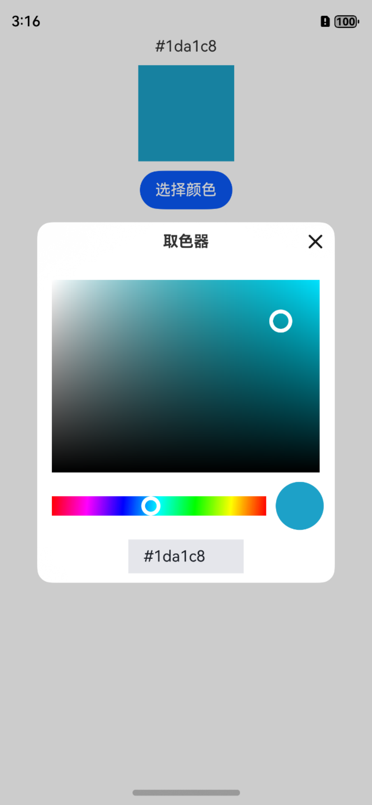

# color-picker



## 简介

color-picker 是一款基于 ArkUI CustomDialog 实现的简单易用的颜色选择器。

## 下载安装

`ohpm i color-picker`

## 使用说明

``` ArkUI
@Entry
@Component
struct Index {
  @State color: string = '#ff0000';

  colorPickDialogController: CustomDialogController | null = new CustomDialogController({
    builder: ColorPickDialog({color: this.color}),
    alignment: DialogAlignment.Center,
    width: '80%',
    cornerRadius: 15,
    backgroundColor: $r('sys.color.background_primary')
  })

  build() {
    Column({space: 10}) {
        Text(this.color)
        Shape() {
          Rect()
            .width(100)
            .height(100)
            .fill(this.color)
        }
        Button('选择颜色')
          .onClick(() => {
            this.colorPickDialogController?.open()
          })
    }
    .height('100%')
    .width('100%')
  }

  aboutToDisappear(): void {
    this.colorPickDialogController = null
  }
}
```


## 开源协议

本项目基于 [Apache License 2.0](https://www.apache.org/licenses/LICENSE-2.0.html) ，在拷贝和借鉴代码时，请大家务必注明出处。
